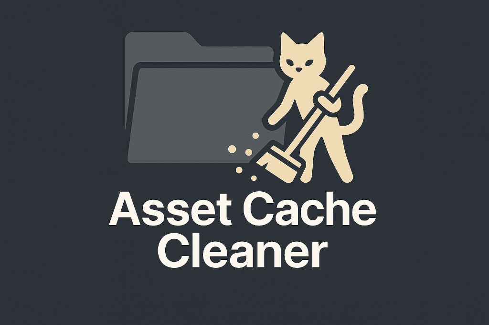
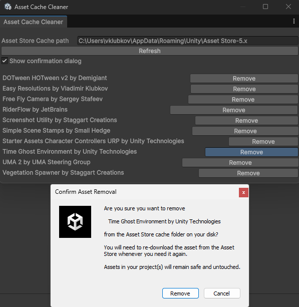

# Asset Cache Cleaner for Unity

Clean Unity Asset Store cache to free up disk space without leaving the Editor.

## Installation

Via Package Manager: 

- HTTPS: `https://github.com/vklubkov/UnityAssetCacheCleaner.git`
- SSH: `git@github.com:vklubkov/UnityAssetCacheCleaner.git`

## Usage

Open the Asset Cache Cleaner window via `Tools/Asset Cache Cleaner`.

Use a `Remove` button to remove an asset.

Use the `Asset Store Cache path` setting to specify a custom path to the Asset Store cache folder.

Use `Refresh` button to update the list of assets.

## AI use disclosure

- AI was used to generate the logo image.
- Some phrasing in this README was improved by AI.
- Some phrasing in the Asset Cache Cleaner UI was improved by AI.

## License

[MIT license](LICENSE.md)

> MIT License
>
> Copyright (c) 2024-2025 Vladimir Klubkov
>
> Permission is hereby granted, free of charge, to any person obtaining a copy
of this software and associated documentation files (the "Software"), to deal
in the Software without restriction, including without limitation the rights
to use, copy, modify, merge, publish, distribute, sublicense, and/or sell
copies of the Software, and to permit persons to whom the Software is
furnished to do so, subject to the following conditions:
>
> The above copyright notice and this permission notice shall be included in all
copies or substantial portions of the Software.
>
> THE SOFTWARE IS PROVIDED "AS IS", WITHOUT WARRANTY OF ANY KIND, EXPRESS OR
IMPLIED, INCLUDING BUT NOT LIMITED TO THE WARRANTIES OF MERCHANTABILITY,
FITNESS FOR A PARTICULAR PURPOSE AND NONINFRINGEMENT. IN NO EVENT SHALL THE
AUTHORS OR COPYRIGHT HOLDERS BE LIABLE FOR ANY CLAIM, DAMAGES OR OTHER
LIABILITY, WHETHER IN AN ACTION OF CONTRACT, TORT OR OTHERWISE, ARISING FROM,
OUT OF OR IN CONNECTION WITH THE SOFTWARE OR THE USE OR OTHER DEALINGS IN THE
SOFTWARE.